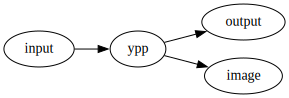

# Yet a PreProcessor

`ypp` is yet another preprocessor. It’s an attempt to merge
[UPP](http://cdelord.fr/upp "Universal PreProcessor") and
[Panda](http://cdelord.fr/panda "Pandoc add-ons (Lua filters for Pandoc)").
It acts as a generic text preprocessor as
[UPP](http://cdelord.fr/upp "Universal PreProcessor") and comes with
macros reimplementing most of the
[Panda](http://cdelord.fr/panda "Pandoc add-ons (Lua filters for Pandoc)")
functionalities
(i.e. [Panda](http://cdelord.fr/panda "Pandoc add-ons (Lua filters for Pandoc)")
facilities not restricted to
[Pandoc](https://pandoc.org "A universal document converter") but also
available to softwares like
[Typst](https://typst.app/ "Compose papers faster")).

Ypp is a minimalist and generic text preprocessor using Lua macros.

It provides several interesting features:

- full
  [Lua](http://www.lua.org/)/[LuaX](http://cdelord.fr/luax "Lua eXtended interpretor")
  interpreter
- variable expansion (minimalistic templating)
- conditional blocks
- file inclusion (e.g. for source code examples)
- script execution (e.g. to include the result of a command)
- diagrams ([Graphviz](http://graphviz.org/),
  [PlantUML](http://plantuml.sourceforge.net/),
  [Asymptote](http://asymptote.sourceforge.net/),
  [blockdiag](http://blockdiag.com/),
  [mermaid](https://mermaidjs.github.io/),
  [lsvg](http://cdelord.fr/lsvg/), …)
- documentation extraction (e.g. from comments in source files)

# Open source

[ypp](http://cdelord.fr/ypp "Yet another PreProcessor") is an Open
source software. Anybody can contribute on
[GitHub](https://github.com/CDSoft/ypp) to:

- suggest or add new features
- report or fix bugs
- improve the documentation
- add some nicer examples
- find new usages
- …

# Installation

``` sh
$ git clone https://github.com/CDSoft/ypp.git
$ cd ypp
$ make install      # install ypp in ~/.local/bin
```

`make install` installs `ypp` in `~/.local/bin`. The `PREFIX` variable
can be defined to install `ypp` to a different directory
(e.g. `make install PREFIX=/usr` to install `ypp` in `/usr/bin`).

**Note**: `ypp` can also be installed with
[makex](https://github.com/CDSoft/makex).

# Test

``` sh
$ make test
```

# Usage

    Usage: ypp [-h] [-l script] [-e expression] [-p path] [-o output]
           [-t {svg,pdf,png}] [--MT target] [--MF name] [--MD]
           [<input>] ...

    Yet a PreProcessor

    Arguments:
       input                 Input file

    Options:
       -h, --help            Show this help message and exit.
       -l script             Execute a Lua script
       -e expression         Execute a Lua expression
       -p path               Add a path to package.path
       -o output             Redirect the output to 'file'
       -t {svg,pdf,png}      Set the default format of generated images
       --MT target           Add `name` to the target list (see `--MD`)
       --MF name             Set the dependency file name
       --MD                  Generate a dependency file

    For more information, see https://github.com/CDSoft/ypp

# Documentation

Lua expressions are embedded in the document to process:
`@( Lua expression )`.

Lua chunks can also be embedded in the document to add new definitions:
`@@( Lua chunk )`.

A macro is just a Lua function. Some macros are predefined by `ypp`. New
macros can be defined by loading Lua scripts (options `-l` and `-e`) or
embedded as Lua chunks.

Expression and chunks can return values. These values are formatted
according to their types:

- `__tostring` method from a custom metatable: if the value has a
  `__tostring` metamethod, it is used to format the value
- arrays (with no `__tostring` metamethod): items are concatenated (one
  line per item)
- other types are formatted by the default `tostring` function.

## Examples

### Lua expression

    The user's home is @(os.getenv "HOME").

    $\sum_{i=0}^100 = @(F.range(100):sum())$

### Lua chunk

    @@( local sum = 0
        for i = 1, 100 do
            sum = sum + i
        end
        return sum
    )

    $\sum_{i=0}^100 = @(sum)$

## Builtin ypp functions

### `ypp`

- `ypp(s)`: apply the `ypp` preprocessor to a string.
- `ypp.input_file()`: return the name of the current input file.
- `ypp.input_path()`: return the path of the current input file.
- `ypp.input_file(n)`: return the name of the nth input file in the
  current *include* stack.
- `ypp.input_file(n)`: return the path of the nth input file in the
  current *include* stack.

## Builtin ypp modules

### `atexit`

- `atexit(func)`: execute `func` when the whole output is computed,
  before actually writing the output.

### `convert`

- `convert(s, [from, to, shift])`: convert the string `s` from the
  format `from` to the format `to` and shifts the header levels by
  `shift`.

This function requires a Pandoc Lua interpreter. The conversion is made
by [Pandoc](https://pandoc.org "A universal document converter") itself.

The parameters `from`, `to` and `shift` are optional. By default Pandoc
converts documents from and to Markdown and the header level is not
modified (as if `shift` were `0`).

### `doc`

- `doc(filename, [opts])`: extract documentation fragments from the file
  `filename` (all fragments are concatenated).

  - `opts.pattern` is the Lua pattern used to identify the documentation
    fragments. The default pattern is `@@@(.-)@@@`.
  - `opts.from` is the format of the documentation fragments
    (e.g. `"markdown"`, `"rst"`, …). The default format is Markdown.
  - `opts.to` is the destination format of the documentation
    (e.g. `"markdown"`, `"rst"`, …). The default format is Markdown.
  - `opts.shift` is the offset applied to the header levels. The default
    offset is `0`.

### `image`

- `image(render, ext)(source)`: use the command `render` to produce an
  image from the source `source` with the format `ext` (`"svg"`, `"png"`
  or `"pdf"`). `image` returns the name of the image (e.g. to point to
  the image once deployed) and the actual file path (e.g. to embed the
  image in the final document).
- `image(render, ext){...}(source)`: same as
  `image(render, ext)(source)` with a few options. `{...}` can define
  some fields:
  - `img`: name of the output image (or a hash if `img` is not defined).
  - `out`: destination path of the image (or the directory of `img` if
    `out` is not defined). The optional `out` field overloads `img` to
    change the output directory when rendering the image.

The `render` parameter is a string that defines the command to execute
to generate the image. It contains some parameters:

- `%i` is replaced by the name of the input document (generated from a
  hash of `source`).
- `%o` is replaced by the name of the output image file (generated from
  the `img` and `out` fields).
- `%h` is replaced by a hash computed from the image source (this option
  is probality completely useless…).

The `img` field is optional. The default value is a name generated in
the directory given by the environment variable `YPP_CACHE` (`.ypp` if
`YPP_CACHE` is not defined).

The file format (extension) must be in `render`, after the `%o` tag
(e.g.: `%o.png`), not in the `img` field.

If the program requires a specific input file extension, it can be
specified in `render`, after the `%i` tag (e.g.: `%i.xyz`).

Some render commands are predefined. For each render `X` (which produces
images in the default format) there are 3 other render commands `X.svg`,
`X.png` and `X.pdf` which explicitely specify the image format. They can
be used similaryly to `image`: `X(source)` or `X{...}(source)`.

| Image engine                                   | ypp function | Example                    |
|------------------------------------------------|--------------|----------------------------|
| [Asymptote](http://asymptote.sourceforge.net/) | `asy`        | `image.asy(source)`        |
| [Blockdiag](http://blockdiag.com/)             | `actdiag`    | `image.actdiag(source)`    |
| [Blockdiag](http://blockdiag.com/)             | `blockdiag`  | `image.blockdiag(source)`  |
| [Blockdiag](http://blockdiag.com/)             | `nwdiag`     | `image.nwdiag(source)`     |
| [Blockdiag](http://blockdiag.com/)             | `packetdiag` | `image.packetdiag(source)` |
| [Blockdiag](http://blockdiag.com/)             | `rackdiag`   | `image.rackdiag(source)`   |
| [Blockdiag](http://blockdiag.com/)             | `seqdiag`    | `image.seqdiag(source)`    |
| [Graphviz](http://graphviz.org/)               | `circo`      | `image.circo(source)`      |
| [Graphviz](http://graphviz.org/)               | `dot`        | `image.dot(source)`        |
| [Graphviz](http://graphviz.org/)               | `fdp`        | `image.fdp(source)`        |
| [Graphviz](http://graphviz.org/)               | `neato`      | `image.neato(source)`      |
| [Graphviz](http://graphviz.org/)               | `osage`      | `image.osage(source)`      |
| [Graphviz](http://graphviz.org/)               | `patchwork`  | `image.patchwork(source)`  |
| [Graphviz](http://graphviz.org/)               | `sfdp`       | `image.sfdp(source)`       |
| [Graphviz](http://graphviz.org/)               | `twopi`      | `image.twopi(source)`      |
| [Mermaid](https://mermaidjs.github.io/)        | `mmdc`       | `image.mmdc(source)`       |
| [PlantUML](http://plantuml.sourceforge.net/)   | `plantuml`   | `image.plantuml(source)`   |
| [ditaa](http://ditaa.sourceforge.net/)         | `ditaa`      | `image.ditaa(source)`      |
| [gnuplot](http://www.gnuplot.info/)            | `gnuplot`    | `image.gnuplot(source)`    |
| [lsvg](http://cdelord.fr/lsvg/)                | `lsvg`       | `image.lsvg(source)`       |

Example:

``` markdown
)
```

is rendered as

<figure>

<figcaption aria-hidden="true">ypp image generation example</figcaption>
</figure>

### `include`

- `include(filename, [opts])`: include the file `filename`.

  - `opts.pattern` is the Lua pattern used to identify the part of the
    file to include. If the pattern is not given, the whole file is
    included.
  - `opts.from` is the format of the input file (e.g. `"markdown"`,
    `"rst"`, …). The default format is Markdown.
  - `opts.to` is the destination format (e.g. `"markdown"`, `"rst"`, …).
    The default format is Markdown.
  - `opts.shift` is the offset applied to the header levels. The default
    offset is `0`.

### `script`

- `script(cmd)(source)`: execute `cmd` to interpret `source`. `source`
  is first saved to a temporary file which name is added to the command
  `cmd`. If `cmd` contains `%s` then `%s` is replaces by the temporary
  script name. Otherwise the script name is appended to the command. An
  explicit file extension can be given after `%s` for languages that
  require specific file extensions (e.g. `%s.fs` for F#).

`script` also predefines shortcuts for some popular languages:

- `script.bash(source)`: run a script with Bash
- `script.bat(source)`: run a script with `command` (DOS/Windows)
- `script.cmd(source)`: run a script with `cmd` (DOS/Windows)
- `script.fs(source)`: run a script with `dotnet fsi` (F# on Windows)
- `script.lua(source)`: run a script with Lua
- `script.python(source)`: run a script with Python
- `script.sh(source)`: run a script with Sh
- `script.zsh(source)`: run a script with Zsh

Example:

    $\sum_{i=0}^100 = @(script.python "print(sum(range(101)))")$

is rendered as

    $\sum_{i=0}^100 = 5050$

### `when`

- `when(cond)(text)`: emit `text` only if `cond` is true.

E.g.:

    @(when(lang="en") [===[
    The current language is English.
    ]===])

## LuaX modules

ypp is written in [Lua](http://www.lua.org/) and
[LuaX](http://cdelord.fr/luax "Lua eXtended interpretor"). All Lua and
LuaX libraries are available to ypp.

[LuaX](http://cdelord.fr/luax "Lua eXtended interpretor") is a Lua
interpretor and REPL based on Lua 5.4.4, augmented with some useful
packages.

LuaX comes with a standard Lua interpretor and provides some libraries
(embedded in a single executable, no external dependency required). Here
are some LuaX modules that can be useful in ypp documents:

- [F](https://github.com/CDSoft/luax/blob/master/doc/F.md): functional
  programming inspired functions
- [L](https://github.com/CDSoft/luax/blob/master/doc/L.md):
  `pandoc.List` module from the Pandoc Lua interpreter
- [fs](https://github.com/CDSoft/luax/blob/master/doc/fs.md): file
  system management
- [sh](https://github.com/CDSoft/luax/blob/master/doc/sh.md): shell
  command execution
- [mathx](https://github.com/CDSoft/luax/blob/master/doc/mathx.md):
  complete math library for Lua
- [imath](https://github.com/CDSoft/luax/blob/master/doc/imath.md):
  arbitrary precision integer and rational arithmetic library
- [qmath](https://github.com/CDSoft/luax/blob/master/doc/qmath.md):
  rational number library
- [complex](https://github.com/CDSoft/luax/blob/master/doc/complex.md):
  math library for complex numbers based on C99
- [crypt](https://github.com/CDSoft/luax/blob/master/doc/crypt.md):
  cryptography module
- [lpeg](https://github.com/CDSoft/luax/blob/master/doc/lpeg.md):
  Parsing Expression Grammars For Lua
- [inspect](https://github.com/CDSoft/luax/blob/master/doc/inspect.md):
  Human-readable representation of Lua tables
- [serpent](https://github.com/CDSoft/luax/blob/master/doc/serpent.md):
  Lua serializer and pretty printer

More information here: <http://cdelord.fr/luax>

# License

    Ypp is free software: you can redistribute it and/or modify
    it under the terms of the GNU General Public License as published by
    the Free Software Foundation, either version 3 of the License, or
    (at your option) any later version.

    Ypp is distributed in the hope that it will be useful,
    but WITHOUT ANY WARRANTY; without even the implied warranty of
    MERCHANTABILITY or FITNESS FOR A PARTICULAR PURPOSE.  See the
    GNU General Public License for more details.

    You should have received a copy of the GNU General Public License
    along with ypp.  If not, see <https://www.gnu.org/licenses/>.

    For further information about ypp you can visit
    http://cdelord.fr/ypp

# Feedback

Your feedback and contributions are welcome. You can contact me at
[cdelord.fr](http://cdelord.fr).
