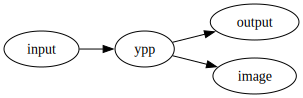

# Yet a PreProcessor

`ypp` is yet another preprocessor. It’s an attempt to merge
[UPP](http://cdelord.fr/upp "Universal PreProcessor") and
[Panda](http://cdelord.fr/panda "Pandoc add-ons (Lua filters for Pandoc)").
It acts as a generic text preprocessor as
[UPP](http://cdelord.fr/upp "Universal PreProcessor") and comes with
macros reimplementing most of the
[Panda](http://cdelord.fr/panda "Pandoc add-ons (Lua filters for Pandoc)")
functionalities
(i.e. [Panda](http://cdelord.fr/panda "Pandoc add-ons (Lua filters for Pandoc)")
facilities not restricted to
[Pandoc](https://pandoc.org "A universal document converter") but also
available to softwares like
[Typst](https://typst.app/ "Compose papers faster")).

Ypp is a minimalist and generic text preprocessor using Lua macros.

It provides several interesting features:

- full
  [Lua](http://www.lua.org/)/[LuaX](http://cdelord.fr/luax "Lua eXtended interpreter")
  interpreter
- variable expansion (minimalistic templating)
- conditional blocks
- file inclusion (e.g. for source code examples)
- script execution (e.g. to include the result of a command)
- diagrams ([Graphviz](http://graphviz.org/),
  [PlantUML](http://plantuml.sourceforge.net/),
  [Asymptote](http://asymptote.sourceforge.net/),
  [blockdiag](http://blockdiag.com/),
  [mermaid](https://mermaidjs.github.io/),
  [Octave](https://octave.org/), [lsvg](http://cdelord.fr/lsvg/), …)
- documentation extraction (e.g. from comments in source files)

# Open source

[ypp](http://cdelord.fr/ypp "Yet another PreProcessor") is an Open
source software. Anybody can contribute on
[GitHub](https://github.com/CDSoft/ypp) to:

- suggest or add new features
- report or fix bugs
- improve the documentation
- add some nicer examples
- find new usages
- …

If you like ypp (or LuaX) and are willing to support its development,
please consider donating via
[Github](https://github.com/sponsors/CDSoft?o=esc) or
[Liberapay](https://liberapay.com/LuaX/donate).

# Installation

[ypp](http://cdelord.fr/ypp "Yet another PreProcessor") requires
[LuaX](http://cdelord.fr/luax "Lua eXtended interpreter").

``` sh
$ git clone https://github.com/CDSoft/luax.git && ninja -C luax install
...

# install ypp in ~/.local/bin
$ git clone https://github.com/CDSoft/ypp.git && ninja -C ypp install
```

`ninja install` installs `ypp` in `~/.local/bin`. The `PREFIX` variable
can be defined to install `ypp` to a different directory
(e.g. `PREFIX=/usr ninja install` to install `ypp` in `/usr/bin`).

**Precompiled binaries**

In case precompiled binaries are needed (GNU/Linux, MacOS, Windows),
some can be found at [cdelord.fr/pub](http://cdelord.fr/pub). These
archives contain ypp as well as some other softwares more or less
related to LuaX.

# Test

``` sh
$ make test
```

# Usage

    Usage: ypp [-h] [-v] [-a] [-l script] [-e expression] [-p path]
           [-o file] [-t {svg,pdf,png}] [--MT target] [--MF name] [--MD]
           [-m char] [<input>] ...

    ypp
    Yet a PreProcessor

    Arguments:
       input                 Input file

    Options:
       -h, --help            Show this help message and exit.
       -v                    Show ypp version
       -a                    Force colorization using ANSI codes
       -l script             Execute a Lua script
       -e expression         Execute a Lua expression
       -p path               Add a path to package.path
       -o file               Redirect the output to 'file'
       -t {svg,pdf,png}      Set the default format of generated images
       --MT target           Add `name` to the target list (implies `--MD`)
       --MF name             Set the dependency file name (implies `--MD`)
       --MD                  Generate a dependency file
       -m char               Set the default macro character (default: '@')

    For more information, see https://github.com/CDSoft/ypp

**Note for Windows users**: since Windows does not support shebangs,
`ypp` shall be explicitly launched with `luax` (e.g.: `luax ypp`). If
`ypp` is not found, it is searched in the installation directory of
`luax` or in `$PATH`.

# Documentation

Lua expressions and chunks are embedded in the document to process.
Expressions are introduced by `@` and chunks by `@@`. Several syntaxes
are provided.

The first syntax is more generic and can execute any kind of Lua
expression or chunk:

- `@(Lua expression)` or `@[===[ Lua expression ]===]`
- `@@(Lua chunk)` or `@@[===[ Lua chunk ]===]`

The second one can be used to read a variable or execute a Lua function
with a subset of the Lua grammar:

- `@ident`: get the value of `ident` (which can be a field of a table.
  E.g. `@math.pi`)
- `@func(...)`, `@func{...}`, `@@func(...)`, `@@func{...}`
- `@func[===[ ... ]===]` or `@@func[===[ ... ]===]`

The expression grammar is:

    expression ::= <identifier> continuation

    continuation ::= '(' well parenthesized substring ')' continuation
                   | '{' well bracketed substring '}' continuation
                   | <single quoted string> continuation
                   | <double quoted string> continuation
                   | <long string> continuation
                   | '[' well bracketed substring ']' continuation
                   | '.' expression
                   | ':' expression
                   | <empty string>

And the third one is an assignment to Lua variables:

- `@@var = ...`

The assignment grammar is:

    assignment ::= <identifier> ( '.' <identifier>
                                | '[' well bracketed expression ']'
                                )*
                   '='
                   ( <number>
                   | 'true' | 'false'
                   | '(' well parenthesized substring ')'
                   | '{' well bracketed substring '}'
                   | <single quoted string>
                   | <double quoted string>
                   | <long string>
                   | expression
                   )

Note: the number of equal signs in long strings is variable, as in Lua
long strings

The Lua code can be delimited with parentheses or long brackets. The
code delimited with parentheses shall only contain well-balanced
parentheses. The long bracket delimiters shall have the same number of
equal signs (which can be null), similarly to Lua literal strings

A macro is just a Lua function. Some macros are predefined by `ypp`. New
macros can be defined by loading Lua scripts (options `-l` and `-e`) or
embedded as Lua chunks.

Expression and chunks can return values. These values are formatted
according to their types:

- `__tostring` method from a custom metatable: if the value has a
  `__tostring` metamethod, it is used to format the value
- arrays (with no `__tostring` metamethod): items are concatenated (one
  line per item)
- other types are formatted by the default `tostring` function.

For documentation purpose, ypp macros can be disabled with the `q`
macro:

    @q[[
    Here, @ has no special meaning.
    ]]

## Examples

### Lua expression

    The user's home is @(os.getenv "HOME").

    $\sum_{i=0}^100 = @(F.range(100):sum())$

### Lua chunk

    @@[[
        sum = 0
        for i = 1, 100 do
            sum = sum + i
        end
    ]]

    $\sum_{i=0}^100 = @sum$

## Builtin ypp functions

### `ypp`

- `ypp(s)`: apply the `ypp` preprocessor to a string.
- `ypp.input_file()`: return the name of the current input file.
- `ypp.input_path()`: return the path of the current input file.
- `ypp.input_file(n)`: return the name of the nth input file in the
  current *include* stack.
- `ypp.input_path(n)`: return the path of the nth input file in the
  current *include* stack.
- `ypp.output_file`: name of the output file.
- `ypp.find_file(filename)`: return the full path name of `filename`
  that can be in the current input file directory or in the current
  directory.
- `ypp.read_file(filename)`: return the content of the file `filename`
  and adds this file to the dependency file.
- `ypp.macro(c)`: use the character `c` to start Lua expressions instead
  of `"@"` (and `cc` instead of `"@@"`).

## Builtin ypp modules

### `atexit`

- `atexit(func)`: execute `func` when the whole output is computed,
  before actually writing the output.

### `comment`

- `comment(...)`: returns an empty string (useful for commenting some
  text)

E.g.:

    @comment [===[
    This paragraph is a comment
    and is not part of the output document.
    ]===]

### `convert`

- `convert(s, [opts])`: convert the string `s` from the format
  `opts.from` to the format `opts.to` and shifts the header levels by
  `opts.shift`.

This function requires a Pandoc Lua interpreter. The conversion is made
by [Pandoc](https://pandoc.org "A universal document converter") itself.

The `opts` parameter is optional. By default Pandoc converts documents
from and to Markdown and the header level is not modified.

The `convert` macro can also be called as a curried function (arguments
can be swapped). E.g.:

    @convert {from="csv"} (script.python [===[
    # python script that produces a CSV document
    ]===])

Notice that `convert` can be implicitely called by `include` or `script`
by giving the appropriate options. E.g.:

    @script.python {from="csv"} [===[
    # python script that produces a CSV document
    ]===]

### `doc`

- `doc(filename, [opts])`: extract documentation fragments from the file
  `filename` (all fragments are concatenated).

  - `opts.pattern` is the Lua pattern used to identify the documentation
    fragments. The default pattern is `@@@(.-)@@@`.
  - `opts.from` is the format of the documentation fragments
    (e.g. `"markdown"`, `"rst"`, …). The default format is Markdown.
  - `opts.to` is the destination format of the documentation
    (e.g. `"markdown"`, `"rst"`, …). The default format is Markdown.
  - `opts.shift` is the offset applied to the header levels. The default
    offset is `0`.

The `doc` macro can also be called as a curried function (arguments can
be swapped). E.g.:

    @doc "file.c" {pattern="///(.-)///"}

### `image`

- `image(render, ext)(source)`: use the command `render` to produce an
  image from the source `source` with the format `ext` (`"svg"`, `"png"`
  or `"pdf"`). `image` returns the name of the image (e.g. to point to
  the image once deployed) and the actual file path (e.g. to embed the
  image in the final document).

The `render` parameter is a string that defines the command to execute
to generate the image. It contains some parameters:

- `%i` is replaced by the name of the input document (temporary file
  containing `source`).
- `%o` is replaced by the name of the output image file (generated from
  a hash of `source`).

Images are generated in a directory given by:

- the environment variable `YPP_IMG` if it is defined
- the directory name of the output file if the `-o` option is given
- the `img` directory in the current directory

If `source` starts with a `@` (e.g. `"@filename"`) then the actual image
source is read from the file `filename`.

The image link in the output document may have to be different than the
actual path in the file system. This happens when the documents are not
generated in the same path than the source document. Brackets can be
used to specify the part of the path that belongs to the generated image
but not to the link in the output document in `YPP_IMG`. E.g. if
`YPP_IMG=[prefix]path` then images will be generated in `prefix/path`
and the link used in the output document will be `path`.

The file format (extension) must be in `render`, after the `%o` tag
(e.g.: `%o.png`).

If the program requires a specific input file extension, it can be
specified in `render`, after the `%i` tag (e.g.: `%i.xyz`).

Some render commands are predefined. For each render `X` (which produces
images in the default format) there are 3 other render commands `X.svg`,
`X.png` and `X.pdf` which explicitely specify the image format. They can
be used similaryly to `image`: `X(source)`.

An optional table can be given before `source` to set some options:

- `X {name="output_name"} (source)` renders `source` and save the image
  to a file named `output_name`. This can help distributing documents
  with user friendly image names.

- `X {pp=func} (source)` renders `func(source)` instead of `source`.
  E.g.: if `func` is `ypp` then `source` is preprocessed by `ypp` before
  being rendered.

| Image engine | ypp function | Example |
|----|----|----|
| [Asymptote](http://asymptote.sourceforge.net/) | `asy` | `image.asy(source)` |
| [Blockdiag](http://blockdiag.com/) | `actdiag` | `image.actdiag(source)` |
| [Blockdiag](http://blockdiag.com/) | `blockdiag` | `image.blockdiag(source)` |
| [Blockdiag](http://blockdiag.com/) | `nwdiag` | `image.nwdiag(source)` |
| [Blockdiag](http://blockdiag.com/) | `packetdiag` | `image.packetdiag(source)` |
| [Blockdiag](http://blockdiag.com/) | `rackdiag` | `image.rackdiag(source)` |
| [Blockdiag](http://blockdiag.com/) | `seqdiag` | `image.seqdiag(source)` |
| [Graphviz](http://graphviz.org/) | `circo` | `image.circo(source)` |
| [Graphviz](http://graphviz.org/) | `dot` | `image.dot(source)` |
| [Graphviz](http://graphviz.org/) | `fdp` | `image.fdp(source)` |
| [Graphviz](http://graphviz.org/) | `neato` | `image.neato(source)` |
| [Graphviz](http://graphviz.org/) | `osage` | `image.osage(source)` |
| [Graphviz](http://graphviz.org/) | `patchwork` | `image.patchwork(source)` |
| [Graphviz](http://graphviz.org/) | `sfdp` | `image.sfdp(source)` |
| [Graphviz](http://graphviz.org/) | `twopi` | `image.twopi(source)` |
| [Mermaid](https://mermaidjs.github.io/) | `mmdc` | `image.mmdc(source)` |
| [PlantUML](http://plantuml.sourceforge.net/) | `plantuml` | `image.plantuml(source)` |
| [ditaa](http://ditaa.sourceforge.net/) | `ditaa` | `image.ditaa(source)` |
| [gnuplot](http://www.gnuplot.info/) | `gnuplot` | `image.gnuplot(source)` |
| [lsvg](http://cdelord.fr/lsvg/) | `lsvg` | `image.lsvg(source)` |
| [octave](https://octave.org/) | `octave` | `image.octave(source)` |

Example:

``` markdown

```

is rendered as

<figure>

<figcaption aria-hidden="true">ypp image generation example</figcaption>
</figure>

### `include`

- `include(filename, [opts])`: include the file `filename`.

  - `opts.pattern` is the Lua pattern used to identify the part of the
    file to include. If the pattern is not given, the whole file is
    included.
  - `opts.exclude` is the Lua pattern used to identify parts of the file
    to exclude. If the pattern is not given, the whole file is included.
  - `opts.from` is the format of the input file (e.g. `"markdown"`,
    `"rst"`, …). The default format is Markdown.
  - `opts.to` is the destination format (e.g. `"markdown"`, `"rst"`, …).
    The default format is Markdown.
  - `opts.shift` is the offset applied to the header levels. The default
    offset is `0`.

- `include.raw(filename, [opts])`: like `include` but the content of the
  file is not preprocessed with `ypp`.

The `include` macro can also be called as a curried function (arguments
can be swapped). E.g.:

    @include "file.csv" {from="csv"}
    @include {from="csv"} "file.csv"

### `q`

- `q(source)`: return `source` unpreprocessed. `q` is used to avoid
  macro execution in a portion of text.

### `script`

- `script(cmd)(source)`: execute `cmd` to interpret `source`. `source`
  is first saved to a temporary file which name is added to the command
  `cmd`. If `cmd` contains `%s` then `%s` is replaces by the temporary
  script name. Otherwise the script name is appended to the command. An
  explicit file extension can be given after `%s` for languages that
  require specific file extensions (e.g. `%s.fs` for F#).

`script` also predefines shortcuts for some popular languages:

- `script.bash(source)`: run a script with bash
- `script.bat(source)`: run a script with `command` (DOS/Windows)
- `script.cmd(source)`: run a script with `cmd` (DOS/Windows)
- `script.lua(source)`: run a script with Lua
- `script.python(source)`: run a script with Python
- `script.sh(source)`: run a script with sh
- `script.zsh(source)`: run a script with zsh

Example:

    $\sum_{i=0}^100 = @script.python "print(sum(range(101)))"$

is rendered as

    $\sum_{i=0}^100 = 5050$

### `when`

- `when(cond)(text)`: emit `text` only if `cond` is true.

E.g.:

    @when(lang=="en")
    [===[
    The current language is English.
    ]===]

### `file`

- `f = file(name)`: return a file object that can be used to create
  files incrementally. Files are only saved once ypp succeed
- `f(s)`: add `s` to the file
- `f:ypp(s)`: preprocess and add `s` to the file

## LuaX modules

ypp is written in [Lua](http://www.lua.org/) and
[LuaX](http://cdelord.fr/luax "Lua eXtended interpreter"). All Lua and
LuaX libraries are available to ypp.

[LuaX](http://cdelord.fr/luax "Lua eXtended interpreter") is a Lua
interpreter and REPL based on Lua 5.4, augmented with some useful
packages.

LuaX comes with a standard Lua interpreter and provides some libraries
(embedded in a single executable, no external dependency required). Here
are some LuaX modules that can be useful in ypp documents:

- [F](https://github.com/CDSoft/luax/blob/master/doc/F.md): functional
  programming inspired functions
- [fs](https://github.com/CDSoft/luax/blob/master/doc/fs.md): file
  system management
- [sh](https://github.com/CDSoft/luax/blob/master/doc/sh.md): shell
  command execution
- [mathx](https://github.com/CDSoft/luax/blob/master/doc/mathx.md):
  complete math library for Lua
- [imath](https://github.com/CDSoft/luax/blob/master/doc/imath.md):
  arbitrary precision integer and rational arithmetic library
- [qmath](https://github.com/CDSoft/luax/blob/master/doc/qmath.md):
  rational number library
- [complex](https://github.com/CDSoft/luax/blob/master/doc/complex.md):
  math library for complex numbers based on C99
- [crypt](https://github.com/CDSoft/luax/blob/master/doc/crypt.md):
  cryptography module
- [lpeg](https://github.com/CDSoft/luax/blob/master/doc/lpeg.md):
  Parsing Expression Grammars For Lua
- [serpent](https://github.com/CDSoft/luax/blob/master/doc/serpent.md):
  Lua serializer and pretty printer
- [json](https://github.com/CDSoft/luax/blob/master/doc/json.md): JSON
  encoder/decoder

More information here: <http://cdelord.fr/luax>

# License

    Ypp is free software: you can redistribute it and/or modify
    it under the terms of the GNU General Public License as published by
    the Free Software Foundation, either version 3 of the License, or
    (at your option) any later version.

    Ypp is distributed in the hope that it will be useful,
    but WITHOUT ANY WARRANTY; without even the implied warranty of
    MERCHANTABILITY or FITNESS FOR A PARTICULAR PURPOSE.  See the
    GNU General Public License for more details.

    You should have received a copy of the GNU General Public License
    along with ypp.  If not, see <https://www.gnu.org/licenses/>.

    For further information about ypp you can visit
    http://cdelord.fr/ypp

# Feedback

Your feedback and contributions are welcome. You can contact me at
[cdelord.fr](http://cdelord.fr).
